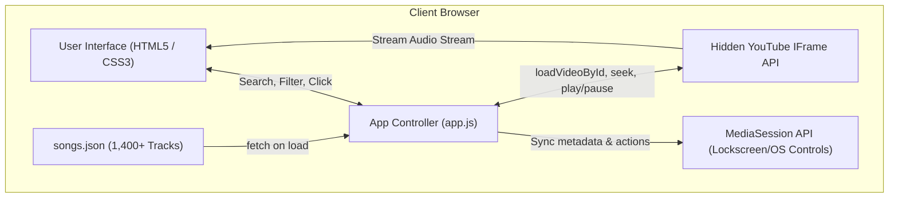

# Aditya Garba — Pure Playlist & Player

A lightweight, no-backend, fast Gujarati Garba music player built with pure HTML, CSS, and JavaScript.

## Features
- **1,400+ Garba Tracks**: High-quality catalogue covering Gujarati folk, dandiya raas, devotional, and nonstop hits.
- **Smart Filtering & Tags**:
  - `Traditional`
  - `Dandiya`
  - `Devotional`
  - `Sanedo`
  - `Folk`
  - `Nonstop`
- **Instant Search**: Search across song titles, artists, and album names in real-time.
- **Full Player Controls**: Play, Pause, Previous, Next, Shuffle, Repeat (One / All), Seek slider, Volume control.
- **Mobile Friendly & Fast**: Minimal payload, zero framework overhead, responsive UI.
- **GitHub Pages Ready**: Static files only (`index.html`, `style.css`, `app.js`, `songs.json`).

Viewed app.js:160-250
Viewed app.js:251-450
Viewed app.js:450-558
Viewed songs.json:1-25

**Aditya Garba** is a **serverless, client-side web application** designed for streaming Gujarati Garba music with zero backend requirements. It streams audio by integrating a hidden YouTube IFrame player with a structured JSON track catalog.

Here is a breakdown of how each layer and component works under the hood:

---

### 1. High-Level Architecture & Tech Stack



- **Frontend:** Pure Vanilla JavaScript (IIFE closure), CSS3 (CSS variables, dark theme), HTML5.
- **Backend / Database:** None. Static JSON file (`songs.json`) acts as the complete database.
- **Audio Engine:** YouTube IFrame API running invisibly in the DOM (`1px × 1px`).

---

### 2. The Data Layer [`songs.json`]

The dataset contains over **1,400 tracks**. Each track entry includes:

```json
{
  "id": "instrumental-dhamal-v1-...",
  "title": "Non Stop Dhamal Disco Dandia...",
  "artist": "Sanjay Sarkar, Ashish Sarkar...",
  "genre": "fusion",
  "duration": 205,
  "album": "Instrumental - Non Stop Dhamal...",
  "year": 1990,
  "yt": "mdfCyh5lBxw",
  "start": 0,
  "nonstop": false
}
```

- **`yt`**: YouTube Video ID used to stream the audio.
- **`start` & `duration`**: Used for timestamp slicing (allows playing specific songs within long DJ mixes or nonstop sets).
- **`nonstop` & `genre`**: Used by the category filtering system.

---

### 3. The Playback Engine [`app.js`]

#### Hidden YouTube IFrame API
- On startup, [`initPlayer()`] dynamically injects `https://www.youtube.com/iframe_api` and creates a minimal player instance with video controls disabled (`controls: 0`, `modestbranding: 1`).
- When a song is selected, [`playSong()`]calls `ytPlayer.loadVideoById({ videoId: song.yt, startSeconds: song.start })`.

#### Sliced Nonstop Set Handling
- A `setInterval` timer (every 400ms) monitors `ytPlayer.getCurrentTime()`.
- If a track is part of a longer mix and reaches `song.duration`, the app automatically cuts to the next track.

#### Error Recovery
- If a video cannot be embedded (YouTube error code `150` or `101`), `onError` catches the event and automatically skips to the next track after 1.2s without breaking the playlist.

---

### 4. Search, Filter & List Rendering

- **Instant Search:** [`applyFilters()`]matches query strings against `title`, `artist`, and `album` simultaneously.
- **Category Filter Pills:** Matches tracks by genre (*Traditional, Dandiya Raas, Devotional, Sanedo, Folk, Nonstop*).
- **DOM Performance:** Uses `DocumentFragment` to batch-insert the 1,400+ song cards into the DOM in a single paint operation.

---

### 5. Controls & System Integration

1. **Playback Modes:**
   - **Shuffle:** Selects a random index from `filteredSongs`.
   - **Repeat:** Cycles through 3 states: `off` $\rightarrow$ `all` (loop playlist) $\rightarrow$ `one` (loop single track).
   - **Smart Previous Track:** If the track has been playing for $>3\text{s}$, clicking previous restarts the track; otherwise, it jumps to the preceding song.
2. **Lockscreen & Background Controls ([`navigator.mediaSession`]):**
   - Integrates with mobile lockscreens, notification bars, and Bluetooth car dashes to show track title, artist, and playback controls.
3. **Keyboard Shortcuts:**
   - <kbd>Space</kbd>: Play / Pause
   - <kbd>→</kbd>: Next track
   - <kbd>←</kbd>: Previous track / Restart track

---

### 6. App Lifecycle (Step-by-Step on Page Load)

1. [`init()`] runs when the page loads.
2. Sets up all DOM event listeners (buttons, keyboard, search, sliders).
3. Fetches [`songs.json`], calculates the total track count, applies initial filters, and renders the track list.
4. Loads the YouTube IFrame API in the background.
5. As soon as the user clicks a song or the **Shuffle All** button, playback begins immediately.